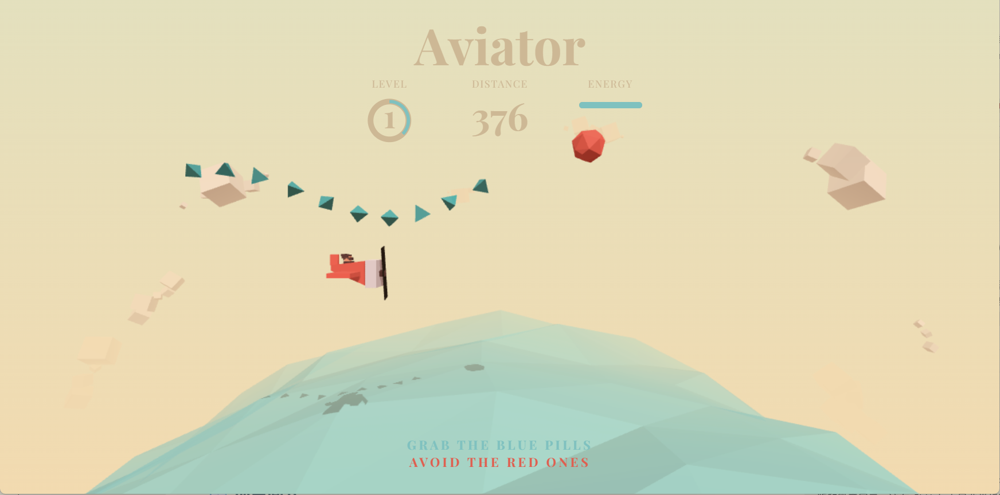
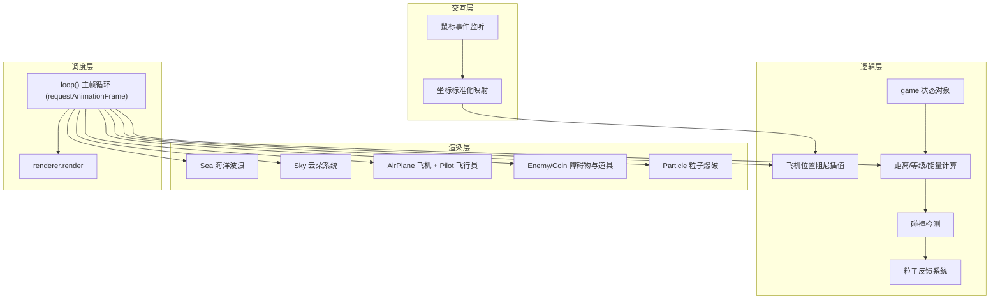

<div align="center">

# ✈️ Aviator

**一个基于 Three.js 的 Low-Poly 风格 3D 飞行小游戏**

[](https://threejs.org/)
[](https://vite.dev/)
[](#)
[](https://dreamlong1.github.io/aviator/)

</div>

<p align="center">
  
</p>

---

## 📖 项目简介

Aviator 是一款纯前端实现的 WebGL 3D 飞行街机游戏。玩家通过鼠标操控一架 Low-Poly 风格的红色双翼战斗机，在无尽的天空与海洋之间穿梭飞行，**收集蓝色能量药丸**以恢复生命，**躲避红色障碍物**以求生存。

游戏完全运行在浏览器中，无需安装任何客户端，零后端依赖。

> 🎮 **[👉 点击这里在线体验游戏](https://dreamlong1.github.io/aviator/)**

---

## 🎬 核心玩法

| 机制 | 说明 |
|:----|:----|
| 🖱️ **鼠标操控** | 移动鼠标即可控制飞机的飞行方向，飞机会以平滑阻尼追随光标，并自动产生真实的翻滚 (Roll) 与俯仰 (Pitch) 姿态 |
| 💊 **能量收集** | 飞行前方的海面上空会按波浪路径刷新蓝色能量药丸，精准飞行并拾取它们可恢复 3 点能量 |
| 💥 **障碍闪避** | 随机出现的红色多面体障碍物带有攻击性，每次碰撞将扣除 50 点能量并触发粒子爆破特效 |
| ❤️ **Two-Hit 机制** | 初始 100 点能量，两次碰撞即 Game Over。硬核容错率考验你的反应力 |
| 📈 **动态升级** | 飞行距离每突破 1000 即自动升级，游戏速度全面递增，大海、云朵、障碍物冲刺频率随等级提升 |
| 🔄 **即时重开** | Game Over 后点击屏幕任意位置即可满血重生，继续挑战 |

---

## 🏗️ 技术架构

### 技术栈

```
Three.js (r183)  ──  3D 渲染引擎
Vite (7.3)       ──  工程化构建工具
ES6+ Modules     ──  模块化代码组织
gh-pages          ──  GitHub Pages 自动化部署
```

### 系统架构图



### 核心类一览

| 类名 | 职责 | 关键实现 |
|:-----|:-----|:---------|
| `Sea` | 海洋表面 | 横置圆柱体 + 逐顶点三角函数波浪动画，直接操作 `Float32Array` |
| `Cloud` / `Sky` | 天空与云层 | 多个随机缩放方块组成云朵，20 朵云环形分布并整体旋转 |
| `AirPlane` | 主角飞机 | 机舱、引擎、尾翼、机翼、螺旋桨 5 大部件几何组合，含顶点法线重算 |
| `Pilot` | 飞行员小人 | 身体、头部、护目镜、耳朵、动态飘逸头发，余弦函数驱动发簇摆动 |
| `Ennemy` / `EnnemiesHolder` | 敌方障碍物 | 红色四面体，容器类负责批量生成、极角旋转与碰撞回收 |
| `Coin` / `CoinsHolder` | 能量药丸 | 蓝色四面体道具，按距离阈值批量生成，碰撞时触发加血与粒子 |
| `Particle` / `ParticlesHolder` | 碰撞粒子 | 爆破碎片四散飘落，随机目标点插值 + 缩放衰减的完整生命周期管理 |

---

## 📁 项目结构

```
Aviator/
├── index.html          # 入口页面 — 含 CSS+DOM 构建的复古风 HUD 面板
├── main.js             # 核心引擎 — 场景/灯光/模型/碰撞/主循环 (915行)
├── style.css           # 全局样式 — UI 层级/字体/动画/能量条
├── vite.config.js      # Vite 配置 — GitHub Pages 部署路径
├── package.json        # 项目依赖 — three, vite, gh-pages
├── public/             # 静态资源
│   └── vite.svg
└── dist/               # 构建产物（自动生成）
```

---

## 🚀 快速开始

### 环境要求

- [Node.js](https://nodejs.org/) (v18+)

### 安装与运行

```bash
# 克隆项目
git clone https://github.com/dreamlong1/aviator.git
cd aviator

# 安装依赖
npm install

# 启动本地开发服务器
npm run dev
```

启动后访问控制台输出的地址（默认 `http://localhost:5173/`）即可体验游戏。

### 构建与部署

```bash
# 生产环境打包
npm run build

# 部署到 GitHub Pages
npm run deploy
```

---

## 🎮 游戏控制

| 操作 | 说明 |
|:-----|:-----|
| 移动鼠标 | 控制飞机飞行方向和高度 |
| 鼠标向上 | 飞机爬升 |
| 鼠标向下 | 飞机俯冲 |
| 鼠标左右 | 飞机侧移 |
| 点击屏幕 | Game Over 后重新开始 |

---

## 🔧 游戏参数速查

| 参数 | 默认值 | 说明 |
|:-----|:-------|:-----|
| `initSpeed` | 0.000525 | 初始基础速度 |
| `energy` | 100 | 初始生命值 |
| `enemyValue` | 50 | 碰撞障碍物扣血量 |
| `coinValue` | 3 | 拾取药丸回血量 |
| `distanceForLevelUpdate` | 1000 | 升级所需飞行距离 |
| `distanceForEnnemiesSpawn` | 50 | 障碍物生成间距 |
| `distanceForCoinsSpawn` | 100 | 药丸生成间距 |

> 所有参数均集中在 `main.js` 的 `resetGame()` 函数中，方便统一调参。

---

## ✨ 技术亮点

### 1. GPU 级 BufferGeometry 顶点操作

海面波浪动画直接修改 `THREE.BufferGeometry` 中的 `Float32Array` 点坐标缓冲，并手动重算 Vertex Normals，绕过上层封装，最大化 GPU 利用率。

### 2. 纯数学轻量碰撞检测

完全放弃物理引擎，在每帧 `requestAnimationFrame` 中使用 `Vector3.length()` 计算三维球面向量距离差，配合安全容差完成零延迟碰撞判定。

### 3. deltaTime 自适应时间轴同步

一切运动、加速、生成节奏严格锚定在帧间距真实时间差 `deltaTime` 上，保证在 60Hz 办公屏到 144Hz 电竞屏上物理位移步调完全一致。

### 4. 现代 Three.js 渲染管线适配

针对 Three.js r152+ 的 PBR 照明与 SRGB 色彩空间管理，通过 `SRGBColorSpace` 配置、`Math.PI` 光照强度补偿系数、以及 `flatShading` 属性注入，完美还原经典 Low-Poly 硬朗美术风格。

### 5. 面向对象的实体池化管理

使用 ES6 Class 对 Enemy、Coin、Particle 进行容器化管理，统一生命周期控制——生成、矩阵运算、视锥体越界回收，避免内存泄漏。

---

## 📄 许可证

本项目仅供学习和个人使用。
